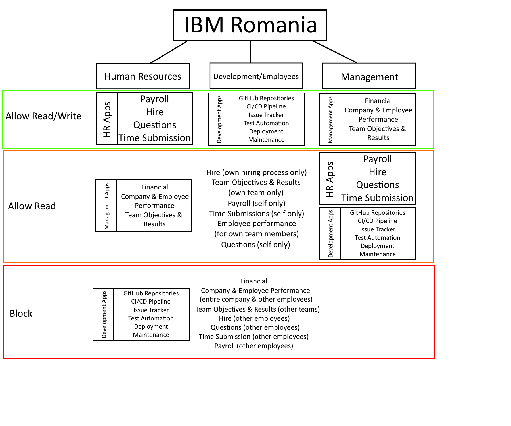

<h1>Mentiuni privitoare la task-uri:</h1>
<h3>
  
1) Videoclipul obtinut in urma decriptarii, in cazul taskului din prima sedinta este:
https://github.com/user-attachments/assets/e9daf115-9d4a-4b7d-9ae7-bfd3e9285bc0

2) Am optat pentru crearea unor scripturi interactive care curata fisierele inainte de executia instructiunilor. Astfel am invatat sintaxa utila pentru crearea scripturilor .sh. 

3) Toate comenzile folosite sunt incluse in folderele respective exerctitiilor (in fisiere cu extensia .sh).
</h3>

-----------------------------------------------------------------------------------------------------

<h3>
  
4) Diagrama functionala a procesului 2FA este:
</h3>

<i>A. Procesul de inrolare 2FA</i>
  1. Utilizatorul isi va activa 2FA (2 Factor Authenticator) pe contul sau, in general dintr-o sectiune a website-ului dedicata acestui proces. Astfel se va incepe procesul de setare a detaliilor aplicatiei 2FA.
  2. Sistemul va genera o cheie secreta unica codata in base-32 pe care o asociaza in mod automat cu contul utilizatorului care a creat-o.
  3. Website-ul va crea un cod QR bazat pe un URI asemeni acestuia <code>otpauth://totp/{NumeAplicatie}:{User}?secret={Secret}&issuer={NumeAplicatie}</code>, unde <code>Secret</code> reprezinta cheia secreta creata la pasul 2. Acest cod QR va trebui scanat cu o aplicatie speciala pentru 2FA (cum ar fi Google Authenticator sau Authy).
  4. Aplicatia 2FA va genera un nou cod TOTP(Time-based One-Time Password) o data la 30 de secunde ce poate fi folosit in procesul de autentificare la o noua sesiune.

<i>B. Login cu 2FA</i>
  1. Se va incepe autentificarea de catre utilizator la fel ca si cum metoda de 2FA nu ar fi activata.
  2. In urma introducerii tuturor datelor necesare autentificarii (username/e-mail/telefon si parola), daca acestea sunt corecte si valide, utilizatorul este informat asupra faptului ca are nevoie de codul TOTP din aplicatia de autentificare setata anterior pentru a capata acces la website.
  3. Se acceseaza aplicatia de autentificare, se copiaza codul TOTP si se introduce in cadrul sectiunii de autentificare din website.
  4. Ultimul pas este reprezentat de validarea TOTP de catre server. Serverul care detine si el aceeasi cheie secreta pentru acel utilizator, genereaza independent propriul sau TOTP folosind acelasi algoritm (de obicei TOTP bazat pe HMAC-SHA1) si aceeasi cheie secreta care a fost partajata in timpul configurarii. De asemenea, se ia in considerare o fereastră de timp mica (de exemplu, 30 de secunde inainte si 30 de secunde dupa ora curenta) pentru a tine cont de posibilele diferente de ora intre dispozitivul utilizatorului si server.
  5. Daca codul 2FA generat de server in cazul pasului 4 se potriveste cu cel introdus de utilizator si generat de aplicatia 2FA atunci accesul utilizatorului la website va fi permis. In caz contrar se va reincerca prin regenerarea codului TOTP de catre server si compararea lui.

<h3>
  
5) Diagrama companiei ceruta in cadrul ultimei sesiuni este:
</h3>

<h2>Rolul aplicatiilor (legenda):</h2>
<h3>HR Apps (Aplicatii Resurse Umane)</h3>
<ul>
  <li><b>Payroll</b> – aplicatie pentru gestionarea salariilor: brut, net, bonusuri, retineri si istoricul platilor.</li>
  <li><b>Hire</b> – platforma pentru procesul de recrutare si onboarding: posturi vacante, primirea CV-urilor, interviuri.</li>
  <li><b>Questions</b> – sistem prin care angajatii pot adresa intrebari catre HR si primesc raspunsuri (ex: concedii, beneficii).</li>
  <li><b>Time Submission</b> – aplicatie pentru inregistrarea timpului lucrat (zilnic/saptamanal/lunar), folosita pentru pontaj si calcul salarii.</li>
</ul>

<h3>Development Apps (Aplicatii de Dezvoltare)</h3>
<ul>
  <li><b>GitHub Repositories</b> – depozite de cod sursa, unde se versioneaza si se colaboreaza pe proiecte software.</li>
  <li><b>CI/CD Pipeline</b> – sistem de automatizare a constructiei, testarii si publicarii aplicatiilor.</li>
  <li><b>Issue Tracker</b> – aplicatie pentru urmarirea bug-urilor, cerintelor si sarcinilor de dezvoltare.</li>
  <li><b>Test Automation</b> – platforma unde sunt rulate automat testele pentru validarea functionalitatilor.</li>
  <li><b>Deployment</b> – procesul prin care aplicatia este instalata sau actualizata pe servere.</li>
  <li><b>Maintenance</b> – activitati de intretinere: patch-uri, backup-uri, optimizari si actualizari de securitate.</li>
</ul>

<h3>Management Apps (Aplicatii Management)</h3>
<ul>
  <li><b>Financial</b> – aplicatie pentru datele financiare ale companiei: bugete, venituri, cheltuieli, profit, proiectii.</li>
  <li><b>Company & Employee Performance</b> – platforma de evaluare a performantei la nivel de companie si angajat.</li>
  <li><b>Team Objectives & Results</b> – sistem care urmareste obiectivele echipelor (ex. OKR) si realizarile acestora.</li>
</ul>
